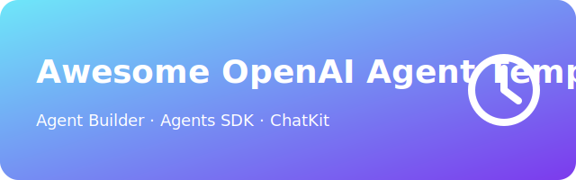

<p align="center">
  
</p>

<h1 align="center">Awesome OpenAI Agent Templates</h1>

<p align="center">
  <a href="https://awesome.re"></a>
  <a href="https://github.com/ChinskiKaczynski/Awesome-OpenAI-Agent-Templates/stargazers"></a>
  
  <a href="https://github.com/ChinskiKaczynski/Awesome-OpenAI-Agent-Templates/pulls"></a>
</p>

> Production-ready templates, tutorials, and patterns for building agents with **OpenAI Agent Builder**, **Agents SDK** (Python/TypeScript), and **ChatKit**.

---

## Table of Contents

- [Overview](#overview)
- [How to Use](#how-to-use)
- [Categories](#categories)
- [Template Registry](#template-registry)
- [Deprecated Templates](#deprecated-templates)
- [Contribute](#contribute)
- [Changelog](#changelog)

## Overview

This repository curates runnable templates and high-quality references so you can go from idea to deployed agentic apps fast. Each template includes:
- **Clear setup** and **run** instructions,
- Pointers to **official docs** for deeper learning,
- Minimal placeholders (`OPENAI_API_KEY`, `VECTOR_STORE_ID`, etc.).

## How to Use

1. **Pick a category** under the repo root:
   - `agent-builder/` – visual workflows (nodes, MCP, guardrails),
   - `agents-sdk-python/` – Python SDK templates,
   - `chatkit/` – embeddable UI templates (hosted file search, web search, auth).

2. **Install dependencies** as described by each template (Python venv / Node, etc.).

3. **Create a `.env`** (when needed) and set:
   ```bash
   OPENAI_API_KEY=sk-...
   ```

4. **Run** the template (instructions inside each template’s README).

> Official docs (recommended):  
> - Agents SDK (Python): https://openai.github.io/openai-agents-python/  
> - Agents SDK (TypeScript): https://openai.github.io/openai-agents-js/  
> - Agent Builder: https://platform.openai.com/docs/guides/agent-builder  
> - ChatKit (Guide & API): https://platform.openai.com/docs/guides/chatkit

## Categories

- **Agents SDK (Python)** – primitives, tools, handoffs, guardrails, sessions/tracing.  
- **Agent Builder** – visual workflows, publishing, MCP servers, guardrails.  
- **ChatKit** – rapid, embeddable chat experiences with hosted tools and document search.

## Template Registry

> ✅ = Verified (link & description), 🔗 = External link, 📁 = Local template

| Template | Category | Link | Status | Description |
|---|---|---:|---|---|
| [📁 Starter Agent (Python)](templates/starter-agent-python.md) | Agents SDK (Python) | [templates/starter-agent-python.md](templates/starter-agent-python.md) | ✅ | Minimal “hello agent” with tools and tracing. |
| [📁 Tool-calling Agent](templates/tool-calling-agent.md) | Agents SDK (Python) | [templates/tool-calling-agent.md](templates/tool-calling-agent.md) | ✅ | Demonstrates function tools + input validation. |
| [📁 ChatKit UI Embed](templates/chatkit-ui-template.md) | ChatKit | [templates/chatkit-ui-template.md](templates/chatkit-ui-template.md) | ✅ | Drop-in ChatKit with hosted integrations. |
| 🔗 Realtime Voice Agents Demo | Agents SDK + Realtime | https://github.com/openai/openai-realtime-agents | ✅ | Advanced patterns for low-latency voice agents. |
| 🔗 Agents SDK Python Examples | Agents SDK (Python) | https://openai.github.io/openai-agents-python/examples/ | ✅ | Category-organized examples from OpenAI. |
| 🔗 Agents SDK TypeScript | Agents SDK (TS) | https://openai.github.io/openai-agents-js/ | ✅ | TypeScript SDK docs & examples. |
| 🔗 Temporal Durable Agents Demos | Advanced patterns | https://github.com/temporal-community/openai-agents-demos | ✅ | Durable execution patterns with Agents SDK. |

**Verification date:** 2025-10-20.

## Deprecated Templates

- **Swarm-based templates** → **Deprecated**. Use the **OpenAI Agents SDK** (the production-ready evolution of Swarm).  

- **Assistants API-based templates** → **Deprecated** (planned sunset **Aug 26, 2026**).  
  *Prefer:* **Responses API** + **Agents SDK/Agent Builder**, or corresponding updated templates.

> See `deprecated/` for migration notes and links.

## Contribute

We welcome high-signal templates, guides, and updates. Please read [CONTRIBUTING.md](./CONTRIBUTING.md) before opening a PR.  
All content must be **English-only**. Add a minimal README for every template and include run instructions.

## Changelog

See [CHANGELOG.md](./CHANGELOG.md).
