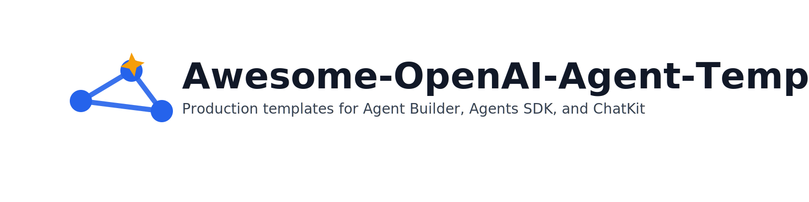

# Awesome-OpenAI-Agent-Templates

> Production-ready templates, tutorials, and patterns for building agents with **OpenAI Agent Builder**, **Agents SDK (Python)**, and **ChatKit**.



[](https://github.com/codespaces/new?hide_repo_select=true&ref=main&repo=ChinskiKaczynski/Awesome-OpenAI-Agent-Templates)
[](https://vercel.com/new/clone?repository-url=https://github.com/ChinskiKaczynski/Awesome-OpenAI-Agent-Templates)

A curated, hands-on collection to go from idea to deployed agentic apps fast. Every template includes clear setup, runnable code (just add `OPENAI_API_KEY`), and links to official docs.

## Table of Contents
- [What’s Inside](#whats-inside)
- [Quick Start](#quick-start)
- [Categories](#categories)
- [Templates](#templates)
- [Tutorials](#tutorials)
- [Guides](#guides)
- [Resources](#resources)
- [Contributing](#contributing)
- [License](#license)

## What’s Inside
- **Templates:** starter Agents SDK (Python), tool-calling agent, and a ChatKit UI embed wired to Agent Builder.
- **Tutorials:** quickstart for Agent Builder, advanced workflows (handoffs, guardrails), step-by-step tool integration.
- **Guides:** deploy ChatKit on Vercel; architecture patterns for production agents.
- **Resources:** official docs, community showcases.

## Quick Start
1. **Clone** this repo.
2. Copy `.env.example` to `.env` and set your secrets:
   ```bash
   OPENAI_API_KEY=sk-...
   NEXT_PUBLIC_WORKFLOW_ID=wf_...   # for ChatKit + Agent Builder
   VECTOR_STORE_ID=vs_...           # optional (File Search)
   ```
3. Run examples:
   - Python: see [`examples/python`](./examples/python)
   - Next.js + ChatKit: see [`examples/next-chatkit`](./examples/next-chatkit)

> Compatibility: Python >= 3.9, `openai>=1.*`, `openai-agents>=0.4.0`.

## Categories
- **Agents SDK (Python):** function tools, hosted tools (Web Search, File Search), sessions, handoffs, guardrails.
- **Agent Builder:** visual workflows, publishing, integrating with ChatKit.
- **ChatKit:** embeddable chat UI (hosted integration), session auth, theming, production tips.

## Templates
- [`templates/starter-agent-python.md`](./templates/starter-agent-python.md)
- [`templates/tool-calling-agent.md`](./templates/tool-calling-agent.md)
- [`templates/chatkit-ui-template.md`](./templates/chatkit-ui-template.md)

## Tutorials
- [`tutorials/quickstart-agent-builder.md`](./tutorials/quickstart-agent-builder.md)
- [`tutorials/advanced-agent-workflows.md`](./tutorials/advanced-agent-workflows.md)
- [`tutorials/integrating-tools-step-by-step.md`](./tutorials/integrating-tools-step-by-step.md)

## Guides
- [`guides/deploying-on-vercel.md`](./guides/deploying-on-vercel.md)
- [`guides/agent-architecture-patterns.md`](./guides/agent-architecture-patterns.md)

## Resources
- [`resources/official-docs-links.md`](./resources/official-docs-links.md)
- [`resources/community-showcases.md`](./resources/community-showcases.md)

## Contributing
We welcome issues and PRs. See [`CONTRIBUTING.md`](./CONTRIBUTING.md) for the workflow.

## License
MIT — see [`LICENSE`](./LICENSE).

## Official Resources (selected)
- Agents SDK (Python) docs: https://openai.github.io/openai-agents-python/ and https://platform.openai.com/docs/guides/agents-sdk
- Built-in Tools: Web Search https://platform.openai.com/docs/guides/tools-web-search and File Search / Vector Stores https://platform.openai.com/docs/api-reference/vector-stores
- ChatKit docs: https://platform.openai.com/docs/guides/chatkit and JS repo https://github.com/openai/chatkit-js
- OpenAI Python SDK (PyPI): https://pypi.org/project/openai/ ; Agents SDK (PyPI): https://pypi.org/project/openai-agents/
