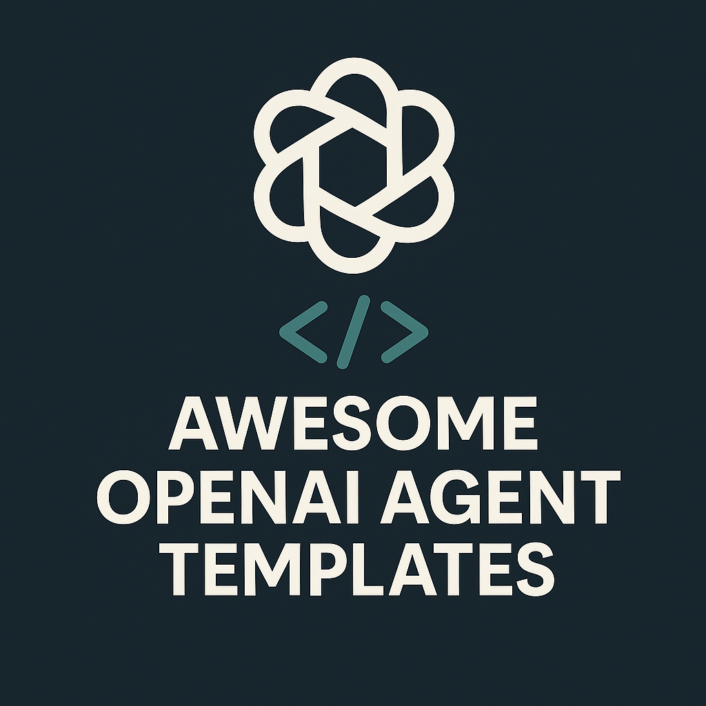

<p align="center">
  
</p>

<h1 align="center">Awesome OpenAI Agent Templates</h1>

<p align="center">
  <a href="https://awesome.re"></a>
  <a href="https://github.com/ChinskiKaczynski/Awesome-OpenAI-Agent-Templates/stargazers"></a>
  
  <a href="https://github.com/ChinskiKaczynski/Awesome-OpenAI-Agent-Templates/pulls"></a>
</p>

> Production-ready templates, tutorials, and patterns for building agents with the **Responses API**, **Agents SDK**, **Realtime API**, and more.

---

## Table of Contents

- [Overview](#overview)
- [⚠️ Deprecation Timeline](#️-deprecation-timeline)
- [How to Use](#how-to-use)
- [Categories](#categories)
- [Template Registry](#template-registry)
- [Deprecated Templates](#deprecated-templates)
- [Contribute](#contribute)
- [Changelog](#changelog)

## Overview

This repository curates runnable templates and high-quality references so you can go from idea to deployed agentic apps fast. Each template includes:

- **Clear setup** and **run** instructions,
- Pointers to **official docs** for deeper learning,
- Minimal placeholders (`OPENAI_API_KEY`, `VECTOR_STORE_ID`, etc.).

## ⚠️ Deprecation Timeline

> **Important dates to plan your migrations:**

| API/Model | Deprecation Date | Replacement | Migration Guide |
|-----------|------------------|-------------|-----------------|
| **Assistants API** | **Aug 26, 2026** | Responses API | [Migration Kit](./Migration/assistants-to-responses/) |
| Realtime API Beta | Feb 27, 2026 | Realtime API GA | [Realtime Voice](./Realtime-Voice/) |
| gpt-4o-realtime-preview | Mar 24, 2026 | gpt-realtime | [Realtime Voice](./Realtime-Voice/) |

## How to Use

1. **Pick a category** under the repo root:
   - `Responses-API/` – Responses API starters (stateful, streaming, tools),
   - `Built-in-Tools/` – web search, file search, code interpreter,
   - `Agent-Patterns/` – routing, guardrails, parallel agents,
   - `Realtime-Voice/` – WebSocket and WebRTC voice agents,
   - `Migration/` – migration guides (Assistants → Responses),
   - `Observability/` – tracing and monitoring,
   - `Agents-SDK-Python/` – Python SDK templates,
   - `ChatKit/` – embeddable UI templates.

2. **Install dependencies** as described by each template (Python venv / Node, etc.).

3. **Create a `.env`** (when needed) and set:

   ```bash
   OPENAI_API_KEY=sk-...
   ```

4. **Run** the template (instructions inside each template's README).

> Official docs (recommended):  
>
> - Responses API: <https://platform.openai.com/docs/guides/responses>  
> - Agents SDK (Python): <https://openai.github.io/openai-agents-python/>  
> - Agents SDK (TypeScript): <https://openai.github.io/openai-agents-js/>  
> - Realtime API: <https://platform.openai.com/docs/guides/realtime>  
> - ChatKit: <https://platform.openai.com/docs/guides/chatkit>

## Categories

| Category | Description | Templates |
|----------|-------------|-----------|
| **Responses API** | Next-gen API for agents | 3 starters |
| **Built-in Tools** | Web search, file search, code interpreter | 3 templates |
| **Agent Patterns** | Routing, guardrails, composition | 4 patterns |
| **Realtime Voice** | Low-latency voice agents | 2 templates |
| **Migration** | API migration guides | 1 guide |
| **Observability** | Tracing and monitoring | 1 template |
| **Agents SDK** | Python/TypeScript SDK | 2 templates |
| **ChatKit** | Embeddable chat UI | 1 template |

## Template Registry

> ✅ = Verified, 📁 = Local template, 🔗 = External link

<!-- REGISTRY_TABLE_START -->

| Template | Category | Languages | Difficulty | Status | Description |
|----------|----------|-----------|------------|--------|-------------|
| 📁 [Responses Minimal](Responses-API/responses-minimal/) | Responses API | python, typescript | Beginner | ✅ | Basic Responses API starter |
| 📁 [Responses Streaming](Responses-API/responses-streaming/) | Responses API | python, typescript | Beginner | ✅ | Streaming responses with SSE |
| 📁 [Stateful Conversations](Responses-API/responses-store-conversation/) | Responses API | python, typescript | Intermediate | ✅ | Multi-turn with store=true |
| 📁 [Web Search Agent](Built-in-Tools/web-search-agent/) | Built-in Tools | python, typescript | Beginner | ✅ | Real-time web search |
| 📁 [File Search Agent](Built-in-Tools/file-search-agent/) | Built-in Tools | python, typescript | Intermediate | ✅ | RAG with vector stores |
| 📁 [Code Interpreter Agent](Built-in-Tools/code-interpreter-agent/) | Built-in Tools | python, typescript | Intermediate | ✅ | Sandboxed code execution |
| 📁 [Routing Agent](Agent-Patterns/routing-agent/) | Agent Patterns | python | Intermediate | ✅ | Multi-agent routing |
| 📁 [Guardrails I/O](Agent-Patterns/guardrails-io/) | Agent Patterns | python | Intermediate | ✅ | Input/output validation |
| 📁 [Agents as Tools](Agent-Patterns/agents-as-tools/) | Agent Patterns | python | Advanced | ✅ | Agent composition |
| 📁 [Parallel Agents](Agent-Patterns/parallel-agents/) | Agent Patterns | python | Advanced | ✅ | Concurrent execution |
| 📁 [WebSocket Minimal](Realtime-Voice/websocket-minimal/) | Realtime Voice | python, javascript | Intermediate | ✅ | WebSocket voice agent |
| 📁 [WebRTC Browser](Realtime-Voice/webrtc-browser/) | Realtime Voice | javascript | Advanced | ✅ | Browser-based voice |
| 📁 [Assistants → Responses](Migration/assistants-to-responses/) | Migration | python | Intermediate | ✅ | Migration guide & examples |
| 📁 [Tracing OTLP](Observability/tracing-otlp/) | Observability | python | Intermediate | ✅ | OpenTelemetry tracing |
| 📁 [Starter Agent](Agents-SDK-Python/) | Agents SDK | python | Beginner | ✅ | Minimal "hello agent" |
| 📁 [ChatKit UI](ChatKit/) | ChatKit | javascript | Beginner | ✅ | Drop-in ChatKit embed |

### External Resources

| Resource | Category | Description |
|----------|----------|-------------|
| 🔗 [Realtime Voice Agents Demo](https://github.com/openai/openai-realtime-agents) | Realtime Voice | Advanced voice agent patterns |
| 🔗 [Agents SDK Examples](https://openai.github.io/openai-agents-python/examples/) | Agents SDK | Official SDK examples |
| 🔗 [Agents SDK TypeScript](https://openai.github.io/openai-agents-js/) | Agents SDK | TypeScript SDK docs |
| 🔗 [Temporal Durable Agents](https://github.com/temporal-community/openai-agents-demos) | Agent Patterns | Durable execution patterns |

<!-- REGISTRY_TABLE_END -->

**Verification date:** 2026-01-08

## Deprecated Templates

- **Swarm-based templates** → **Deprecated**. Use the **OpenAI Agents SDK** (the production-ready evolution of Swarm).  

- **Assistants API-based templates** → **Deprecated** (shutdown **Aug 26, 2026**).  
  *Prefer:* **Responses API** + **Agents SDK**, or use the [Migration Kit](./Migration/assistants-to-responses/).

> See `Deprecated/` for migration notes and links.

## Contribute

We welcome high-signal templates, guides, and updates. Please read [CONTRIBUTING.md](./CONTRIBUTING.md) before opening a PR.  
All content must be **English-only**. Add a minimal README for every template and include run instructions.

## Registry

Templates are defined in [`registry.yml`](./registry.yml). Run `python scripts/generate-readme.py` to update the table above.

## Changelog

See [CHANGELOG.md](./CHANGELOG.md).
